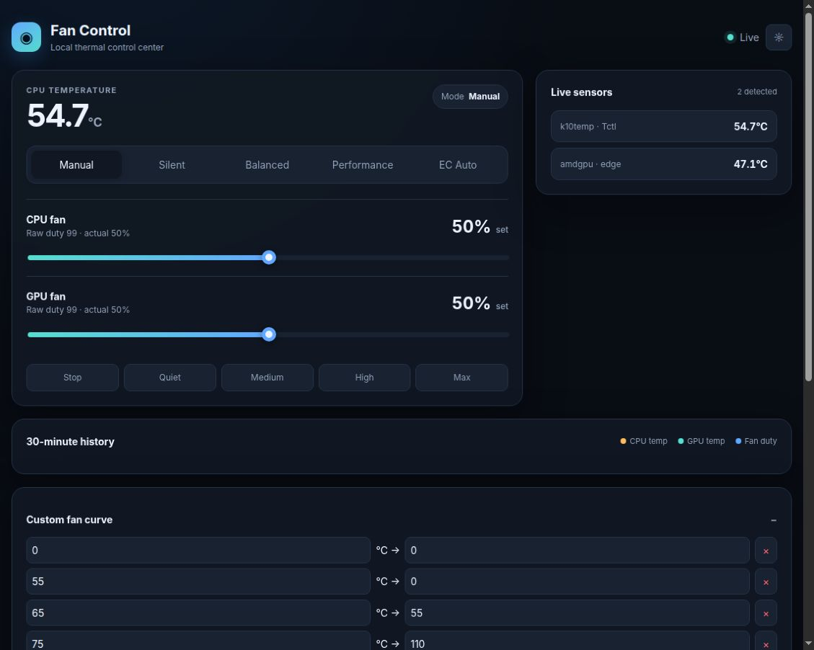
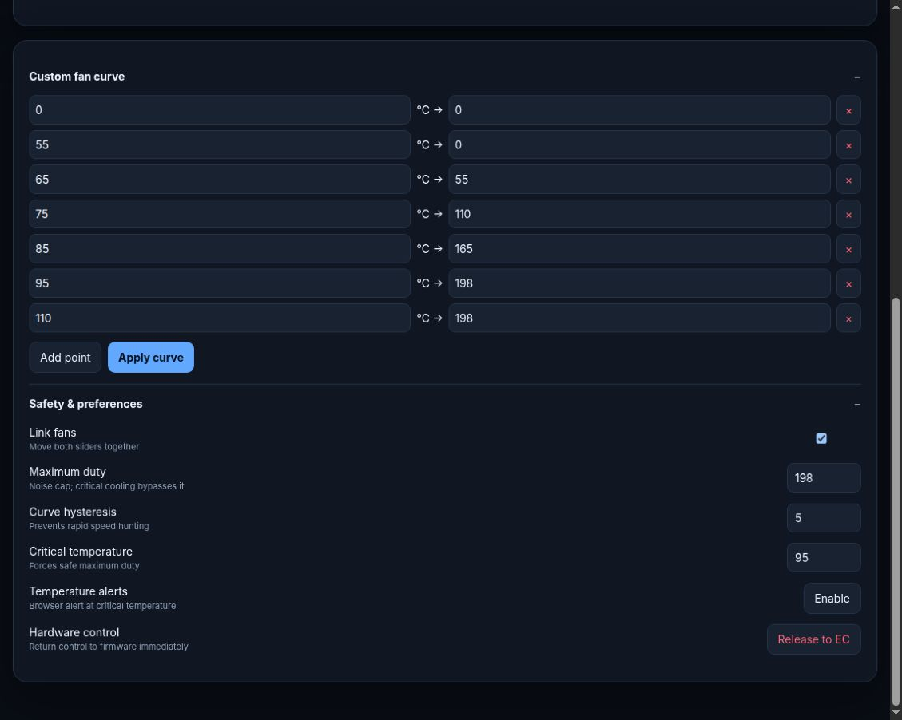

<div align="center">

# Clevo/Tongfang Fan Control

**A safety-focused Linux fan-control daemon and local web dashboard for compatible Clevo/Tongfang systems.**

[](https://github.com/vindeckyy/fan-control/actions/workflows/ci.yml)
[](https://kernel.org/)
[](https://www.python.org/)
[](#unofficial-project)

</div>

> [!IMPORTANT]
> **Unofficial community project.** This software is not affiliated with,
> endorsed by, sponsored by, or supported by Clevo, Tongfang, any laptop
> reseller, or any kernel-driver vendor. Use it at your own risk.

Fan Control provides automatic temperature curves, direct manual control,
live CPU/GPU telemetry, and a responsive local dashboard. It is deliberately
small, dependency-free, and bound to localhost.

## Dashboard





## Features

- Silent, Balanced, Performance, custom-curve, manual, and firmware-auto modes
- Independent or linked CPU/GPU fan targets
- Critical-temperature override that bypasses the user noise cap
- Curve hysteresis to prevent rapid speed hunting
- Automatic handoff to firmware when temperature data becomes unavailable
- Live hwmon sensors with an NVIDIA `nvidia-smi` fallback
- Thirty-minute CPU temperature, GPU temperature, and fan-duty history
- Persistent configuration with atomic writes
- Responsive dark/light dashboard and optional browser alerts
- Serialized EC access and clean daemon/dashboard ownership handoff
- Hardware-free demo mode for safe evaluation and UI development

## Compatibility

Fan Control is intended for Linux systems that meet all of these requirements:

| Requirement | Details |
| --- | --- |
| Hardware | Clevo/Tongfang-based system with a compatible EC interface |
| Kernel interface | A supported character device matching `/dev/*_io` |
| Runtime | Python 3.10 or newer; standard library only |
| Privileges | Root access for EC reads and writes |
| Service manager | systemd for the included background service |
| NVIDIA telemetry | Optional; requires a working `nvidia-smi` command |

Hardware compatibility varies by model and firmware. Start with demo mode,
then verify sensor readings and fan response before enabling the service.

## Safety model

Fan Control treats thermal control as a safety-critical path:

- All normal writes are clamped to duty `198`; values near `200` are known to
  behave unpredictably on affected firmware.
- At `critical_temp`, both fans are commanded to duty `198` even when a lower
  noise cap is configured.
- After three invalid temperature readings, the daemon returns control to the
  system firmware until valid telemetry returns.
- The dashboard and daemon never intentionally own the EC interface at the
  same time.

> [!CAUTION]
> Confirm the reported temperatures and physical fan response on your exact
> machine. Incorrect low-level fan control can cause overheating or hardware
> damage.

## Installation

Clone the repository and install the two executables plus the service unit:

```bash
git clone https://github.com/vindeckyy/fan-control.git
cd fan-control

sudo install -Dm755 fan-daemon.py /usr/local/bin/fan-daemon
sudo install -Dm755 fan-gui.py /usr/local/bin/fan-gui
sudo install -Dm644 fan-daemon.service /etc/systemd/system/fan-daemon.service
sudo systemctl daemon-reload
sudo systemctl enable --now fan-daemon
```

Check the service after installation:

```bash
systemctl status fan-daemon
journalctl -u fan-daemon -n 50 --no-pager
```

## Usage

Open the local dashboard:

```bash
sudo fan-gui
```

The dashboard listens only on `http://127.0.0.1:4444`. While it is open, it
temporarily stops the daemon and takes ownership of the EC interface. Closing
the dashboard releases control and restarts the daemon.

Run the daemon directly with a built-in profile:

```bash
sudo fan-daemon --profile balanced
```

Preview the complete dashboard without root or compatible hardware:

```bash
FAN_CONTROL_CONFIG=/tmp/fan-control-demo.json fan-gui --demo
```

Preview daemon decisions without opening an EC device:

```bash
fan-daemon --dry-run --profile silent
```

## Configuration

Both programs read `/etc/fan-control.json`. The dashboard writes this file
atomically when settings change.

```json
{
  "profile": "balanced",
  "max_duty": 198,
  "hysteresis": 5,
  "critical_temp": 95
}
```

| Key | Default | Purpose |
| --- | ---: | --- |
| `profile` | `balanced` | Active automatic curve |
| `curve` | built-in | Custom `[temperature, duty]` points |
| `max_duty` | `198` | Normal-operation noise cap |
| `hysteresis` | `5` | Minimum duty change before curve updates |
| `critical_temp` | `95` | Temperature that forces maximum safe duty |

Device discovery selects the sole `/dev/*_io` candidate. If multiple
candidates exist, set `FAN_CONTROL_DEVICE` or pass `--device` explicitly:

```bash
sudo FAN_CONTROL_DEVICE=/dev/example_io fan-gui
```

## Architecture

```text
hwmon / NVIDIA telemetry ──► temperature selection ──► curve + safety policy
                                                              │
                                                              ▼
firmware auto ◄── ownership handoff ◄── serialized EC access ◄── duty target
                                      ▲
                                      │
                         localhost web dashboard
```

- `fan-daemon.py` owns automatic background control.
- `fan-gui.py` serves the local dashboard and interactive control API.
- `fan-daemon.service` starts the daemon at boot.
- `test_fan_control.py` covers interpolation, safety bounds, curve validation,
  device overrides, dashboard contracts, and NVIDIA parsing.

## Troubleshooting

### No fan-control device found

Confirm that the compatible kernel interface is loaded and that a character
device exists:

```bash
ls -l /dev/*_io
```

### Dashboard does not open

Check whether another process is using port `4444`, then run the dashboard in
a terminal to retain the error message:

```bash
ss -ltnp 'sport = :4444'
sudo fan-gui --no-browser
```

### NVIDIA temperature is missing

Verify that the driver can report temperature:

```bash
nvidia-smi --query-gpu=index,temperature.gpu,name --format=csv,noheader,nounits
```

## Development

The project intentionally uses only the Python standard library.

```bash
python3 -m py_compile fan-daemon.py fan-gui.py test_fan_control.py
python3 -m unittest -v
```

See [CONTRIBUTING.md](CONTRIBUTING.md) before proposing hardware-facing
changes. Security issues should follow [SECURITY.md](SECURITY.md).

## Unofficial project

Clevo and Tongfang names are used only to describe hardware compatibility.
All product names and trademarks belong to their respective owners. This
repository provides no manufacturer warranty, certification, or support.
