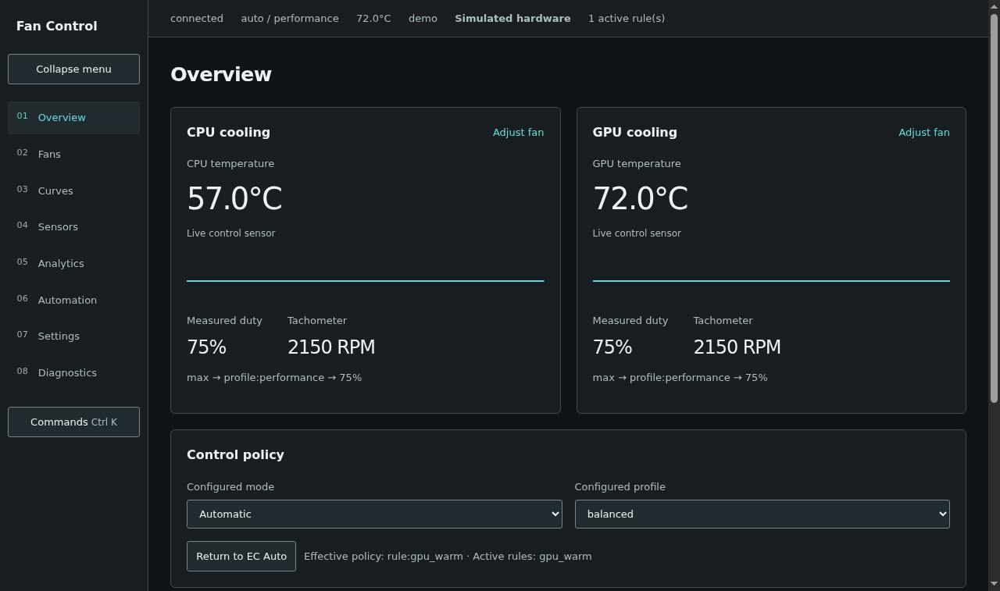
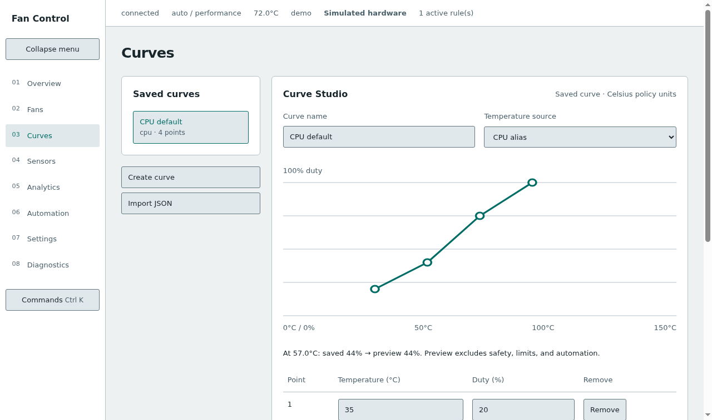

<div align="center">

# Clevo/Tongfang Fan Control

**A safety-focused cross-platform fan-control daemon and native desktop workstation for compatible Clevo/Tongfang systems on Linux and Windows.**

[](https://github.com/vindeckyy/fan-control/actions/workflows/ci.yml)
[](https://github.com/vindeckyy/fan-control)
[](https://www.python.org/)
[](#unofficial-project)

</div>

> [!IMPORTANT]
> **Unofficial community project.** This software is not affiliated with,
> endorsed by, sponsored by, or supported by Clevo, Tongfang, any laptop
> reseller, or any kernel-driver vendor. Use it at your own risk.

Fan Control provides automatic temperature curves, direct manual control,
live CPU/GPU telemetry, dual-axis history graphs, and a native desktop
window. The dashboard runs as a native desktop application (GTK4 + WebKitGTK 6
on Linux, Edge WebView2 / pywebview on Windows) communicating with the daemon
over a secure local socket; it does not require external cloud services.

## Features

- Native desktop window (no localhost web server)
- Silent, Balanced, Performance, custom-curve, manual, and firmware-auto modes
- Independent or linked CPU/GPU fan curves and targets
- Visual curve editor with named import/export
- Critical-temperature override that bypasses the user noise cap
- Curve hysteresis to prevent rapid speed hunting
- Automatic handoff to firmware when temperature data becomes unavailable
- Live hwmon sensors with an NVIDIA `nvidia-smi` fallback and optional pinning
- Thirty-minute live telemetry and SQLite history with retention and CSV export
- Read-only Clevo tach (RPM) when the backend exposes it; Uniwill tach is not probed
- Persistent configuration with atomic writes
- Dark/light/system themes, Celsius/Fahrenheit display, desktop notifications, tray controls, `fan-ctl` CLI
- Dedicated Overview, Fans, Curves, Sensors, Analytics, Automation, Settings, and Diagnostics pages
- Revision-checked edits, per-fan policies, temporary fan tests, and explainable control decisions
- Transient automation rules and weekly schedules, including overnight blocks
- Hardware-free demo mode for safe evaluation and UI development

## Compatibility

Fan Control supports hardware backends on both Linux and Windows. It auto-detects which
one is present; use `--backend` or `FAN_CONTROL_BACKEND` to override.

| Requirement | Details |
| --- | --- |
| Hardware | Clevo/Tongfang-based system with a compatible EC interface |
| Linux Backends | `tuxedo_io` (ioctls on a `/dev/*_io` device) or `clevo_acpi` (sysfs) |
| Windows Backends | `windows_ec` (direct EC port I/O 0x62/0x66 via InpOutx64/WinRing0) or `windows_wmi` (ACPI WMI) |
| Linux Desktop | GTK 4 and WebKitGTK 6 (`gir1.2-gtk-4.0`, `gir1.2-webkit-6.0`, `python3-gi`) |
| Windows Desktop | Edge WebView2 (native app mode or via `pywebview`), with tray via `pystray` |
| Runtime | Python 3.10 or newer |
| Privileges | Root (Linux) or Administrator (Windows) for the daemon; desktop dashboard runs unprivileged |
| Service manager | systemd (Linux) or Windows Task Scheduler / Service (Windows) |
| Telemetry | Linux: hwmon sysfs. Windows: ACPI WMI thermal zones. Both: optional `nvidia-smi` |

On Linux, the `tuxedo_io` backend drives duty through ioctls on a character device
matching `/dev/*_io`. The `clevo_acpi` backend drives per-fan duty through
plain sysfs files under `/sys/class/leds/clevo-acpi::kbd_backlight/device/`,
and relies on that driver's kernel-side watchdog to return control to
firmware auto if the controlling process stops.

On Windows, the `windows_ec` backend communicates directly with the Embedded Controller
(ports 0x66 command/status and 0x62 data) via standard I/O helper libraries
(`inpoutx64.dll` or `WinRing0x64.dll`). The `windows_wmi` backend provides fallback
ACPI thermal zone queries via PowerShell WMI/CIM.

Hardware compatibility varies by model and firmware. Start with demo mode,
then verify sensor readings and fan response before enabling the service.

## Safety model

Fan Control treats thermal control as a safety-critical path:

- Duty is authored as a percentage 0-100. The `tuxedo_io` backend maps this
  onto its native raw 0-198 domain at the edge, keeping the known-safe cap of
  198; values near 200 are known to behave unpredictably on affected firmware.
- At `critical_temp`, both fans are commanded to 100% even when a lower noise
  cap is configured.
- After three invalid temperature readings, the daemon returns control to the
  system firmware until valid telemetry returns.
- On the `clevo_acpi` backend, the kernel-side watchdog independently releases
  to firmware auto if the controlling process stops renewing a manual override.
- The background daemon (`fan-daemon`) is the sole root owner of the EC
  interface and runs continuously.
- The dashboard window runs unprivileged as the desktop user. WebKit never
  runs as root; it communicates with `fan-daemon` over a local Unix socket
  restricted to the `fan-control` group (`0660 root:fan-control`).
- Safety-critical policy lives in Python (`fan_policy.py`), not in JavaScript.
> [!CAUTION]
> Confirm the reported temperatures and physical fan response on your exact
> machine. Incorrect low-level fan control can cause overheating or hardware
> damage.

## Installation

### Package installation

Published packages are available from [GitHub Releases](https://github.com/vindeckyy/fan-control/releases/latest). This working tree contains the unreleased v2 implementation. For a locally built v2 Debian package:

```bash
sudo dpkg -i fan-control_2.0.0-1_amd64.deb
sudo usermod -aG fan-control $USER
sudo systemctl enable --now fan-daemon
```

### From source

Debian/Kali:

```bash
sudo apt install python3 python3-gi gir1.2-gtk-4.0 gir1.2-webkit-6.0 nodejs npm
```

Fedora: `python3-gobject gtk4 webkitgtk6.0 nodejs`.
Arch: `python-gobject gtk4 webkitgtk-6.0 nodejs npm`.

Building the UI requires Node.js 20 or newer. Clone, build the UI, and install:

```bash
git clone https://github.com/vindeckyy/fan-control.git
cd fan-control
sudo make install
sudo systemd-sysusers /usr/lib/sysusers.d/fan-control.conf
sudo systemd-tmpfiles --create /usr/lib/tmpfiles.d/fan-control.conf
sudo usermod -aG fan-control $USER
sudo systemctl daemon-reload
sudo systemctl enable --now fan-daemon

```

Check the service after installation:

```bash
systemctl status fan-daemon
journalctl -u fan-daemon -n 50 --no-pager
```

### Windows setup & usage

On Windows 10 (build 17063+ / version 1803+) and Windows 11, Python 3.10+ is supported. Windows natively supports `AF_UNIX` domain sockets, enabling the same zero-latency, secure IPC architecture as Linux.

#### Windows Executables (.exe)
Native 64-bit Windows PE executables are provided:
- **`fan-control.exe`** (and **`fan-gui.exe`**): Native Windows GUI launcher (windowed subsystem, no flashing console window) with high-res icon and DPI-aware manifest. Launches the dashboard directly.
- **`fan-ctl.exe`**: Native Windows console CLI executable for status, curves, fans, and diagnostics.
- **`fan-daemon.exe`**: Native Windows daemon executable for background thermal control.

These launchers automatically detect portable Python (`python/pythonw.exe`), virtual environments (`.venv/`), system Python, or Microsoft Store Python.

#### 1. Running the GUI (.exe or batch)
Double-click **`fan-control.exe`**, or from command line:
```cmd
fan-control.exe
:: Hardware-free demo mode:
fan-control.exe --demo
```
*(Or use `scripts\run-gui-windows.bat`)*

#### 2. Running the CLI
```cmd
fan-ctl.exe status --json
fan-ctl.exe profile silent
fan-ctl.exe diagnose
```

#### 3. Running the Daemon
To control physical hardware, run the daemon from an elevated command prompt (Administrator):
```cmd
fan-daemon.exe --backend windows_ec
```
*(Or use `scripts\run-daemon-windows.bat`)*

#### 4. Install Background Service on Windows
To have the fan-control daemon start automatically on Windows boot with Administrator privileges without showing a terminal window, run PowerShell as Administrator:
```powershell
powershell -ExecutionPolicy Bypass -File scripts\install-service-windows.ps1
```
*(To uninstall: `powershell -ExecutionPolicy Bypass -File scripts\install-service-windows.ps1 -Uninstall`)*

#### 5. Building Windows Executables (.exe)
- **Recompile Native Launchers**: Run `make windows-exe` (uses `x86_64-w64-mingw32-gcc` and `windres`).
- **Create Standalone Portable Package**: Run `scripts\package-portable-windows.bat` to download official Python 3.12 embeddable and produce a zero-dependency `dist\fan-control-portable\` folder.
- **Build PyInstaller Bundle**: Run `scripts\build-exe.bat` on Windows (uses `packaging\windows\fan-control-pyinstaller.spec`) to build frozen binaries in `dist\fan-control-windows\`.

#### Hardware EC Port I/O Driver (Optional for direct fan control)
For direct EC fan register read/write (`windows_ec`), ensure a standard user-mode I/O DLL such as `inpoutx64.dll` or `WinRing0x64.dll` is located in `%SystemRoot%\System32` or the project root. If no low-level driver is present, the daemon safely reports hardware status, or you can run with ACPI WMI fallback (`--backend windows_wmi`) or the simulated backend (`--backend demo`).

## Usage

Open the native dashboard (runs unprivileged; no sudo needed):

```bash
fan-gui
```

`fan-daemon` remains running in the background while the window is open and
continues managing the embedded controller.

Preview without root or compatible hardware:

```bash
FAN_CONTROL_CONFIG=/tmp/fan-control-demo.json python3 fan-gui.py --demo
```

Headless snapshot for CI and scripts:

```bash
FAN_CONTROL_CONFIG=/tmp/fan-control-demo.json python3 fan-gui.py --demo --headless-smoke
```

Display-only tray (never locks the EC; profile changes route over the socket):

```bash
fan-gui --tray
```

CLI:

```bash
fan-ctl status --json
fan-ctl profile silent
fan-ctl mode released
fan-ctl set 1 40
fan-ctl cap 80
fan-ctl config hysteresis=3 linked=false
fan-ctl curve cpu
fan-ctl curves
fan-ctl curves load quiet
fan-ctl diagnose
```

Run the daemon directly:

```bash
sudo fan-daemon
fan-daemon --dry-run
fan-daemon --diagnose
```

## Configuration

The daemon owns `/etc/fan-control.json` on Linux (or `%PROGRAMDATA%\fan-control\config.json` on Windows). Desktop and CLI controls submit RPC
mutations; they do not write this file directly. On Linux, the daemon reloads administrator
edits on `SIGHUP` / `systemctl reload fan-daemon`.

Version 2 stores fan policies, curves, rules, schedules, safety, display, and
history preferences in separate sections. Every saved mutation increments
`revision`. A client can send `expected_revision` to reject stale edits.
Existing v1 files migrate on load, with a `*.v1.backup.json` preserved before
the first v2 write. The following flat fields remain supported by the legacy
RPC adapters; they are not the v2 disk schema. See [the v2 plan](docs/v2-plan.md)
for the schema and migration contract.

```json
{
  "profile": "balanced",
  "mode": "curve",
  "max_duty": 100,
  "hysteresis": 5,
  "critical_temp": 95,
  "linked": true
}
```

| Key | Default | Purpose |
| --- | ---: | --- |
| `profile` | `balanced` | Active automatic curve |
| `mode` | `manual` | `manual`, `curve`, or `released` |
| `curve` | built-in | Shared `[temperature, duty]` points |
| `curve_cpu` / `curve_gpu` | none | Independent curves when `linked` is false |
| `max_duty` | `100` | Normal-operation noise cap, as a percentage |
| `hysteresis` | `5` | Minimum duty change before curve updates |
| `critical_temp` | `95` | Temperature that forces maximum safe duty |
| `linked` | `true` | Drive both fans from the same curve/target |
| `named_curves` | `{}` | Saved custom curves |
| `cpu_sensor` / `gpu_sensor` | hottest defaults | Pinned hwmon/WMI identity `{name, label}` |
| `theme` | `dark` | `dark` or `light` |
| `alerts.desktop` | `false` | Desktop notifications at critical temperature |

Backend selection is automatic. Set `FAN_CONTROL_BACKEND` or pass `--backend`
to override. On Windows, available backends include `windows_ec`, `windows_wmi`, and `demo`.

## Architecture

The v2 control path is `fan_controller.py` → pure `fan_engine.py` → backend.
`fan_rules.py` computes temporary rule and schedule overlays. `fan_history.py`
stores normalized telemetry in SQLite. Every decision records its source,
requested duty, limits, final duty, and whether the backend write succeeded.
The React workspace uses hash routing, a typed client, and separate stores
for connection, configuration, live telemetry, and presentation state.

```text
hwmon / WMI / NVIDIA telemetry ──► temperature selection ──► curve + safety policy
                                                               │
                                                               ▼
        ┌────── clevo_acpi sysfs ───────┐  ◄── duty target ───┤
        │                               │                     │
backend ┼──── tuxedo_io ioctls ─────────┤  ◄── percent duty ──┤
        │                               │                     │
        ├──── windows_ec port I/O ──────┤                     │
        │                               │                     │
        ├──── windows_wmi ACPI ─────────┤                     │
        │                               │                     │
        └──── demo (simulated) ─────────┘                     │
                         │                                    │
                         ▼                                    │
       firmware auto ◄── ownership handoff ◄── watchdog / release
```

- `fan_backend.py`: hardware backends (Linux `tuxedo_io` / `clevo_acpi`, Windows `windows_ec` / `windows_wmi`, and cross-platform `demo`).
- `fan_policy.py`: versioned configuration, migration, validation, curve math, and cross-platform sensor discovery.
- `fan_engine.py` and `fan_rules.py`: pure control decisions, rules, and schedules.
- `fan_history.py`: SQLite persistence, query aggregation, and memory fallback.
- `fan_controller.py`: controller logic and JSON-RPC dispatch methods.
- `fan_rpc.py`: Unix-socket JSON-RPC server and client (supported on Linux and Windows 10/11 build 17063+).
- `fan_diagnostics.py`: system and hardware diagnostics for Linux and Windows.
- `fan_gtk.py`: unprivileged GTK4 + WebKitGTK 6 workspace and tray for Linux.
- `fan_windows_gui.py`: native unprivileged desktop workspace (Edge WebView2 / pywebview) and tray (`pystray`) for Windows.
- `fan-gui.py`: GUI entry point (`--demo`, `--tray`, `--headless-smoke`) dispatching to Linux GTK or Windows native runner.
- `fan-daemon.py`: background control service and sole EC owner.
- `fan-ctl.py`: CLI client communicating with the daemon over the local socket.
- `ui/`: React + Vite workspace loaded via native custom scheme (Linux) or loopback bridge (Windows).

## Troubleshooting

### No fan-control hardware found

```bash
sudo fan-daemon --diagnose
sudo fan-ctl diagnose
```

### Dashboard does not open

Install GI bindings (`gir1.2-gtk-4.0`, `gir1.2-webkit-6.0`) and build the UI
(`cd ui && npm ci && npm run build`). Run `python3 fan-gui.py --demo --debug`
to enable the WebKit inspector.

### NVIDIA temperature is missing

```bash
nvidia-smi --query-gpu=index,temperature.gpu,name --format=csv,noheader,nounits
```

## Development

```bash
python3 -m py_compile fan_backend.py fan_policy.py fan_runtime.py fan_controller.py fan-daemon.py fan-gui.py fan-ctl.py test_fan_control.py
python3 -m unittest -v
cd ui && npm ci && npm test && npm run build
FAN_CONTROL_CONFIG=/tmp/fan-control-demo.json python3 fan-gui.py --demo
```

See [CONTRIBUTING.md](CONTRIBUTING.md) before proposing hardware-facing
changes. Security issues should follow [SECURITY.md](SECURITY.md).

## Unofficial project

Clevo and Tongfang names are used only to describe hardware compatibility.
All product names and trademarks belong to their respective owners. This
repository provides no manufacturer warranty, certification, or support.

## v2 workspace and CLI

Overview shows temperatures, fan response, and effective policy. Fans edits
independent policies and runs expiring tests. Curves edits reusable curves
with local previews and explicit Save. Sensors selects control sources and
history pins. Analytics queries persisted history. Automation tests rules and
edits schedules. Settings contains safety and display preferences. Diagnostics
explains individual writes and exports a report.

`Ctrl+K` opens page and control commands. In Manual mode, `[` and `]` adjust
the first fan target in 5% steps, following the configured legacy linking.
Curve points support arrow keys and Delete as well as pointer dragging.

```bash
fan-ctl capabilities --json
fan-ctl fans list --json
fan-ctl fans configure fan1 'control={"type":"manual","target":45}' min_duty=20 max_duty=90
fan-ctl fans test fan1 delta=10 duration_ms=5000
fan-ctl curves list
fan-ctl curves assign fan1 cpu_default
fan-ctl sensors list
fan-ctl rules list
fan-ctl rules test gpu_warm
fan-ctl rules disable gpu_warm
fan-ctl history stats
fan-ctl history query max_points=600 'fans=["fan1"]'
fan-ctl diagnostics --json
```

History defaults to `/var/lib/fan-control/history.db` on Linux (or `%PROGRAMDATA%\fan-control\data\history.db` on Windows) with seven-day retention.
Command execution through automation is not included. Package version 2.0.0
uses epoch 1 so it sorts after the previous calendar-version packages.

### v2 verification

```bash
make test
ruff check .
python3 scripts/check_versions.py
xvfb-run -a python3 scripts/gtk-smoke.py
python3 scripts/ui-demo.py
# In another terminal, with Chromium, chromedriver, and Python Selenium installed:
python3 scripts/ui-acceptance.py
```

The acceptance harness uses isolated simulated hardware and produces
screenshots under `docs/images/v2`. It is not the application's runtime
transport. The native application continues to use the local Unix socket.



